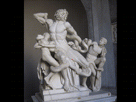

# FB SVG Clipper

**FB (FreeBasic) SVG Clipper** is a tool that allows to **clip images** using the **Bézier tool** and exports it in a **SVG file**  with a linked and clipped image.

The code is released under the terms of the *GNU LESSER GENERAL PUBLIC LICENSE Version 3*. It works on Windows an Linux environnements.

FB SVG CLipper is written in [**FreeBasic language**](http://www.freebasic.net). I appreciate that other FreeBasic's users share their knowledge, see [aknowledgments](aknowledgments.md).

## User guide

To launch the program input as arguments the name of the fvg file to open (_if it doesn't exist it will be created when saving_) and a valid JPG file. The program should be launched by the command-line.

Example (_windows_):

`fbvg filename.fvg filename.jpg`

At the moment it's important that both `fvg file` and `image file` are in the same folder of the program.

### Compiling instructions

`fbc -exx -g -w all "%f"`

In the console the list of the working commands will appear during the running of the program.

### Keyboard shortcuts

#### Tools:

`P` - **Pen tool**

**Click and drag** the mouse to **create a node**. Press `alt` key while dragging to create a not sloped node. Click on the beginning of the path to close the path itself.

`CANC (DELETE)` **Delete** the last node created

`CTRL + CANC (DELETE)` Delete the whole working path

----

`H` - **Hand tool** Click and drag the mouse to pan the workarea

----

`Mouse wheel` will affect the zoom ratio

----

`V` - **Select tool**

Click and drag to **select** path / paths

`CANC (DELETE)` **delete** selected paths

----

`CTRL + S` **Save** the .fvg file - *WARNING:* it overwrites existing file with same name

`CTRL + E` **Export** the SVG file - *WARNING:* it overwrites existing file with same name

`CTRL + Q` **Quit** the program - *WARNING:* it doesn't ask to save the file

----

### TO DO List in order of importance

- select nodes
- Export SVG compound path
- Export SVG with embedded clipped bitmap
- better image handling
- Move points
- Move paths
- SPACEBAR -> Hand Tool
- Undo Levels
- Join paths
- Cut paths
- Scale paths
- Rotate paths
- Copy paths
- Export as transparent PNG

### Version history

**0.0.9**

- delete selected paths

**0.0.8**

- delete last node
- delete working path

**0.0.7**

- more options from the command-line

**0.0.6**

- thick line
- improved panning 

**0.0.5**

- save and load file
- export svg
- better pen tool pointer icon

**0.0.4**

- auto close paths

**0.0.3**

- improved paths

**0.0.2**

- adding paths

**0.0.1**

- pan and zoom
- jpg load

## Important note
This software is developed in the hope it will be useful. *It's still a beta version and the developer is not responsible of any data loss it could cause*. By compiling and running it on your local machine you agree this statement.